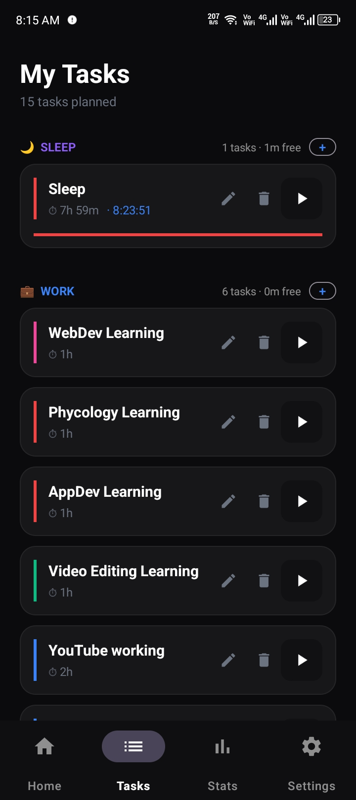
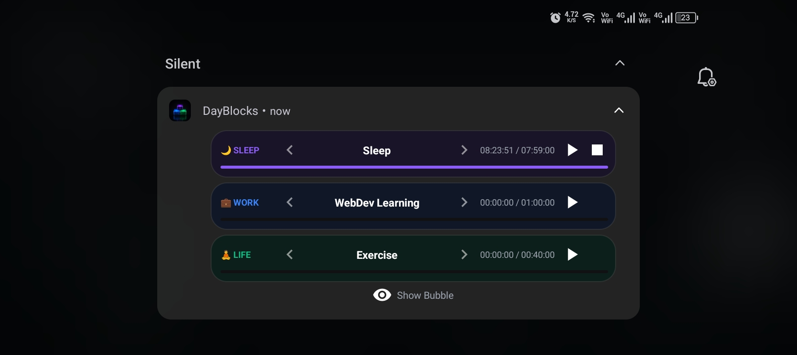

# DayBlocks

<div align="center">
  
  
  
</div>

<p align="center">
  <strong>DayBlocks</strong> is a calm, focused Android app for turning your day into intentional time blocks.
  Plan your <em>Sleep</em>, <em>Work</em>, and <em>Personal</em> time, start timed sessions, and keep momentum going with live notifications and a quick-access bubble.
</p>

<p align="center">
  <a href="#features"></a>
  <a href="#getting-started"></a>
</p>

---

## 🌟 Why DayBlocks?

DayBlocks helps you build a healthier rhythm by making your day feel structured instead of scattered.

- Organize your day into three core blocks: Sleep, Work, and Personal
- Add tasks with custom durations and colors
- Track time as you work with a live timer
- Stay in control with notification-based controls and quick actions
- Review your progress through daily stats and history

---

## ✨ Features

### 🧠 Smart Time Budgeting
Create a realistic plan for the day using the 8-8-8 mindset and keep each block balanced.

### ⏱️ Focused Task Tracking
Start, pause, and switch tasks with a smooth in-app timer experience.

### 🔔 Live Notifications
Keep the timer visible and actionable from the notification panel.

### 🫧 Floating Quick Actions
Use a lightweight bubble interface for rapid task control without opening the app.

### 📊 Progress & History
See how your day is flowing with summaries, task counts, and completed sessions.

---

## 📱 Screenshots

### 🗂️ Task Screen
The task screen is where your day comes into focus. You can see your planned blocks, manage tasks at a glance, and keep your schedule feeling calm and intentional.

<div align="center">
  
</div>

### 🔔 Notification Experience
The notification experience keeps your timer visible and actionable even when you are working away from the main screen. It gives you quick control without breaking your flow.

<div align="center">
  
</div>

> These preview images are pulled directly from the assets folder for a polished GitHub presentation.

---

## 🚀 Getting Started

### Requirements
- Android Studio
- JDK 17
- Android SDK with API 34 support

### Build
```bash
./gradlew assembleDebug
```

On Windows:
```powershell
gradlew.bat assembleDebug
```

### Run
Open the project in Android Studio and launch it on an emulator or physical device.

---

## 🛠️ Tech Stack

- Kotlin
- AndroidX / Material 3
- Navigation Component
- Room Database
- DataStore Preferences
- Coroutines

---

## 📂 Project Structure

- app/src/main/java — app logic, UI, services, and view models
- app/src/main/res — layouts, drawables, navigation, and theme resources
- app/src/main/AndroidManifest.xml — app permissions and service registration

---

## 🤝 Contributing

Contributions are welcome. If you have ideas for improving the experience, feel free to open an issue or submit a pull request.

---

## 📜 License

This project is currently provided as a personal productivity app project.
